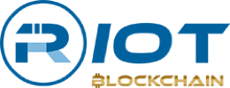

# Riot Blockchain

## Overview and Origin

**Company:** Riot Blockchain

**Headquarters:** Castle Rock, CO

**Incorporated:** 09/19/2017

**Founders:** 

**How did the idea for the company (or project) come about?**
    
Riot Blockchain was founded on September 19, 2017 after a publicly traded company named BiOptix decided to change their name. BiOptix was a biological sciences technology firm that was founded in 2000 and went public in 2003. BiOptix Diagnostics is now a subsidiary of Riot Blockchain.

**How is the company funded? How much funding have they received?**
    
Riot Blockchain was acquired by Venaxis on September 13, 2016 and was founded a year later. Riot Blockchain is a publicly traded company and they have been funding mining hardware purchases through their sale of stock as well as their proceeds from directly mining bitcoin. Shortly after changing their name, the stock saw a massive increase from $8 to $40 within months of the name change.

## Business Activities:

**What specific financial problem is the company or project trying to solve?**
    
Riot Blockchain's goal aligns with Bitcoin blockchain technology which provides a decentralized, peer-to-peer network for individuals to send or receive payments. According to the company's website:
> " Riot Blockchain is focused on supporting the bitcoin ecosystem through proof-of-work mining. We are believers in the bitcoin opportunity and our continued efforts aimed at growing our mining operation demonstrates our commitment to the bitcoin network."

In other words, Riot Blockchain's mining business directly supports the bitcoin network and blockchain by completing "blocks" of verified transactions and helping maintain trasnactions on the network's ledger.

**Who is the company's intended customer?  Is there any information about the market size of this set of customers? What solution does this company offer that their competitors do not or cannot offer? (What is the unfair advantage they utilize?)**
        
Riot Blockchain does not have any direct customers. The company is focused on supporting the Bitcoin network through its mining operation. Over the years, it has become one of the largest U.S. based bitcoin miners by employing thousands of bitcoin miners and rapidly growing its fleet of revolutionary hardware. Every miner competes for speed -- in other words, the quicker your hardware, the more "blocks" you are able to mine. This is measured by a miner's Hash Rate:
> "The hash rate is a measurement of how many times the Bitcoin network is able to attempt to complete the calculations each second. It’s the approximate average of all the hash rates of each individual mining machine in the network. A higher hash rate is better because it increases the miner’s chances of finding the next block and receiving the bitcoin reward."
    
*Source: [SoFi Learn](https://www.sofi.com/learn/content/bitcoin-hash-rate/#:~:text=The%20hash%20rate%20is%20a,mining%20machine%20in%20the%20network.)*

The company also focuses on targeted investments in the Blockchain and Cryptocurrency domain. In 2017, Riot acquired TESS (Canadian blockahin company) and in 2018, it acquired Logical Brokerage Corporation (futures broker). A list of their portfolio can be found [here](https://www.riotblockchain.com/portfolio).  

    

**Which technologies are they currently using, and how are they implementing them? (This may take a little bit of sleuthing–– you may want to search the company’s engineering blog or use sites like Stackshare to find this information.)**
    
In February 2020, Riot Blockchain deployed 4,000 S17 Pro miners from Bitmain which brought the companies hash rate capacity to 247 PH/s. By November 2020, thousands of S19 Pro miners were added bringing the company's fleet total to 7,040 miners with a hash rate capacity of 566 PH/s. Awaiting a new shipment of thousands of S19 Pro miners, Riot Blockchain will increase to 1.45 EH/s or 1,446 PH/s. That is almost 6x the company's hash rate a little over a year ago. The company will also have increased their mining operation from 4,000 miners to 15,040 miners in the same timeframe.

However, one of the largest miners in the U.S that competes with Riot Blockchain is Marathon Patent Group. By September 2021, Marathon expects to increase their mining operation to 33,560 ASIC miners generating 3.56 EH/s. This is roughly 2.5x more than Riot Blockchain's hash rate. Albeit, by September 2021, Riot Blockchain may also increase their hash rate significantly and is not too far behind given how late in the game they joined the mining business. 

## Landscape:

**Domain** : Blockchain and Cryptocurrencies

**What have been the major trends and innovations of this domain over the last 5-10 years?**
    
Blockchain and Cryptocurrencies have gained interest from all over the world in the past 10 years. Bitcoin was created in 2009, shortly after the Great Financial Crisis and it is the first of it's kind. Throughout the years, thousands of new cryptocurrencies have been created including Ethereum (ETH) and Litecoin (LTC) which are considered among the top 3 cryptocurrencies in the world. 

**What are the other major companies in this domain?**
    
Blockchain Technology and Cryptocurrencies have created an opportunity for thousands of companies all over the world. From mining operations to trading platforms, here is a list of some big companies in the domain:
* Coinbase (Fintech, Trading)
    * Digital portfolio that allows individuals to buy/sell cryptocurrencies      
* Marathon Patent Group (Fintech)
    * Public mining company that mines cryptocurrencies
* Grayscale Bitcoin Trust (Investments, Trading)
    * Investment fund that directly correlates with Bitcoin's performance
* Salt Lending (Fintech, Lending)
    * Individuals can leverage their cryptocurrency holdings for cash. Loans start at $5,000
* Gemini (Fintech, Cryptocurrency, Trading)
    * Similar to coinbase, users can buy/sell cryptocurrencies. Gemini uses blockchain for both trading and cybersecurity purposes
* Civil (Digital Media, Journalism)
    * Journalism published on a blockchain so it can not be altered or deleted

## Results

**What has been the business impact of this company so far?**

Riot Blockchain's primary focus is on Bitcoin and Blockchain Technology. Through their mining operation, they are supporting the Bitcoin network by helping maintain the public ledger. Through their targeted investments, Riot is also able to support different companies that utilize blockchain technology for different purposes. They have invested in Coinsquare and have acquired a futures broker and a payments and remmittances company that uses blockchain. 

**What are some of the core metrics that companies in this domain use to measure success? How is your company performing, based on these metrics?**

The main component that is measured for a mining company such as Riot, is the company's hash rate. Another very important factor is the cost of electricity that is consumed by operating large farms of mining hardware. 

**How is your company performing relative to competitors in the same domain?**

As previously mentioned, one of Riot"s biggest competitors is Marathon Patent Group which has more than double of Riot's mining fleet (~15k vs. 33.5k) and more than 2.5x hash rate capacity (1.45 EH/s vs. 3.56 EH/s). 

## Recommendations

**If you were to advise the company, what products or services would you suggest they offer? (This could be something that a competitor offers, or use your imagination!)**

I would advise the company to start developing their own hardware for mining. They know what it takes for hardware to be competitive in the mining industry and by investing in this idea, they may be able to create state-of-the-art hardware that will directly benefit them as well as the Blockchain and Cryptocurrencies domain as a whole

**Why do you think that offering this product or service would benefit the company?**

If successful, this would generate a new stream of income for the company by generating sales revenue from their equipment as well as increasing their opererational hash rate capacity.

**What technologies would this additional product or service utilize?**

This would require very powerful GPUs that are provided by manufacturers such as Nvidia and Advanced Micro Devices.

**Why are these technologies appropriate for your solution?**

These are very important because they ultimately allow a computer to operate at very fast speeds resulting in a much higher hash rate. 

## Sources

* https://www.riotblockchain.com/
    * https://www.riotblockchain.com/about
    * https://www.riotblockchain.com/about/management-team
    * https://www.riotblockchain.com/bitcoin-mining
* https://www.bloomberg.com/profile/company/RIOT:US
* http://crypto.marketswiki.com/index.php?title=Riot_Blockchain
* https://www.crunchbase.com/organization/bioptix-inc#section-overview
    * https://www.crunchbase.com/acquisition/venaxis-acquires-bioptix-inc--b3565f12
* https://builtin.com/blockchain/blockchain-companies-roundup
* https://www.investopedia.com/terms/b/bitcoin-mining.asp
* https://www.crunchbase.com/organization/bioptix-inc

